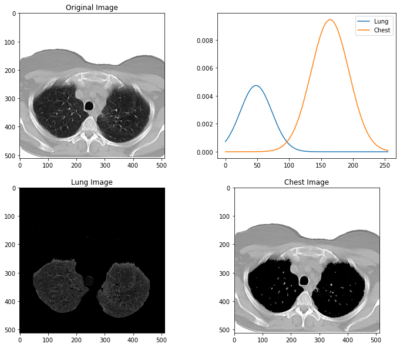

# Lung Segmentation Using Bayesian Decision Theory

### Final project for Medical Imaging course at Mansoura University.

* [Modeling notebook](./Modeling_notebok.ipynb)

* [Pyqt5 desktop app file](./app.py)

#### Project outcome:
